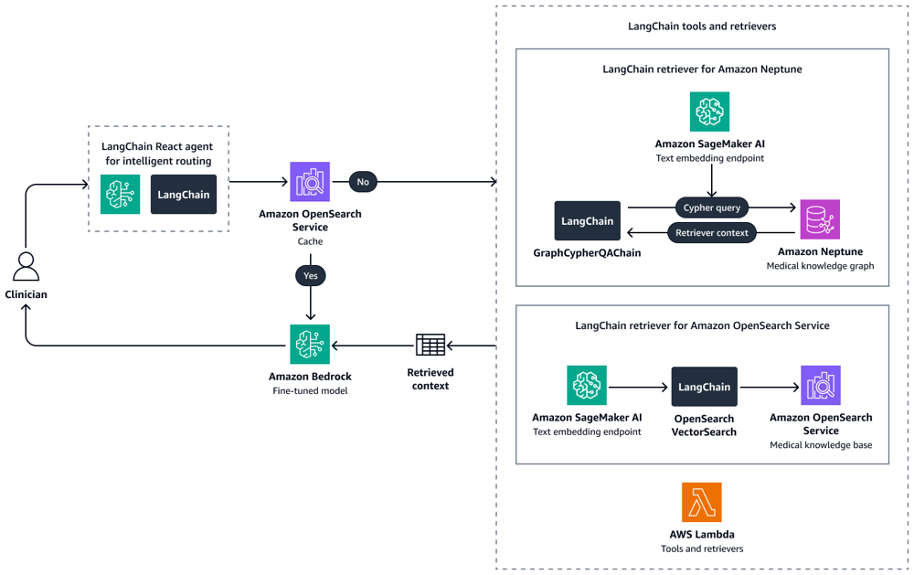

# Thiết kế hệ thống trợ lý lâm sàng bệnh viện

## 1. 🧩 Phân tích vấn đề (Problem Breakdown)

**Các tính năng chính:** Trợ lý AI cần tóm tắt hồ sơ y tế bệnh nhân, hướng dẫn quy trình nội bộ, và trả lời câu hỏi hành chính. Những tác vụ này có thể chia thành ba kịch bản chính: 
- *Tóm tắt lâm sàng:* Ví dụ tóm tắt lịch sử bệnh, tổng hợp chẩn đoán và đơn thuốc từ hồ sơ y tế. Đây là trường hợp *rủi ro cao*, vì thông tin sai lệch có thể dẫn đến quyết định điều trị sai【24†L65-L73】【10†L92-L100】. Một lỗi nhỏ trong tóm tắt có thể gây hậu quả nghiêm trọng cho bệnh nhân.  
- *Hỗ trợ quy trình chăm sóc:* Ví dụ nhắc nhở quy trình thăm khám, hướng dẫn chuẩn SOP (Standard Operating Procedures) nội bộ. Mức độ rủi ro trung bình- cao: tuy không trực tiếp quyết định điều trị, nhưng sai sót có thể ảnh hưởng đến chất lượng và tuân thủ quy trình.  
- *Câu hỏi hành chính:* Ví dụ lịch hẹn, điền mẫu biểu, quy định bệnh viện. Đây là kịch bản *rủi ro thấp* hơn (chủ yếu ảnh hưởng hiệu quả vận hành, không ảnh hưởng trực tiếp bệnh nhân) nhưng vẫn cần chính xác.  

**Rủi ro:** Các câu trả lời có thể chứa thông tin PHI (Protected Health Information). Bất kỳ rò rỉ nào đều vi phạm HIPAA/GDPR. Đặc biệt, tóm tắt y tế là *kịch bản rủi ro đặc biệt cao*, vì bác sĩ thường dựa vào đó để hình thành “sơ đồ nhận thức” ban đầu về bệnh nhân【24†L98-L107】【10†L92-L100】. Do đó, hệ thống phải cực kỳ chính xác và có cơ chế rà soát. Lỗi trong kịch bản hành chính ít nghiêm trọng hơn, nhưng vẫn cần đảm bảo tính hợp lệ và có thể cần cơ chế kiểm tra (ví dụ phê duyệt của nhân viên).

## 2. 🏗️ Kiến trúc tổng thể (High-Level Architecture)

Hệ thống gồm ba lớp chính: giao diện người dùng, dịch vụ backend với lớp AI, và lớp dữ liệu. Frontend (web/app nội bộ) xác thực người dùng (SSO/AD, OAuth2) và gửi truy vấn đến backend. Backend có *cổng API* (API Gateway) để phân phối yêu cầu tới các dịch vụ thích hợp: phần *orchestrator* (định tuyến truy vấn, kiểm tra quyền truy cập dựa trên vai trò) và phần *AI RAG* (kéo dữ liệu liên quan và gọi LLM).  

Dữ liệu lưu trữ bao gồm:  
- **EMR/EHR:** Thông tin y tế bệnh nhân (sử dụng FHIR hoặc HL7 để tích hợp).  
- **Lịch hẹn & CSDL nội bộ:** Lưu trữ thông tin lịch khám, thông tin hành chính.  
- **SOP/Văn bản bệnh viện:** Các tài liệu quy trình, hướng dẫn (định dạng văn bản).  

Dòng dữ liệu (flow) như sau: Dữ liệu **(EMR, SOP, lịch hẹn)** được đồng bộ vào hệ thống qua các *connector* và pipeline: HL7/FHIR nhập liệu, OCR cho tài liệu giấy, v.v. Hệ thống xử lý (preprocessing) chia nhỏ văn bản, xóa định danh nếu cần, sinh embedding và lưu vào vector DB. Khi có truy vấn, orchestrator xác thực người dùng, quyết định loại truy vấn (bệnh nhân cụ thể hay chung, hành chính hay lâm sàng) rồi gọi RAG pipeline tương ứng. Lấy ví dụ, nếu bác sĩ yêu cầu “Tóm tắt bệnh án của bệnh nhân A”, hệ thống sẽ: lấy ID bệnh nhân, kiểm tra quyền, truy vấn vector DB chỉ với dữ liệu của Bệnh nhân A (đã được cài địa chỉ), lấy ngữ cảnh lâm sàng liên quan, rồi đưa vào prompt cho LLM. Mô hình AI tạo kết quả, hệ thống thực hiện kiểm tra đảm bảo không lộ PHI ngoài phạm vi quyền rồi trả lời cho UI. Trong khi đó, các luồng đồng bộ (sync) diễn ra tức thời cho truy vấn, còn các luồng bất đồng bộ (async) như thu thập dữ liệu mới và indexing chạy nền.

**Các thành phần chính:** Frontend (ứng dụng web/máy tính) cung cấp giao diện hỏi đáp và lưu lịch; backend gồm dịch vụ auth (SSO, MFA), dịch vụ orchestration (định tuyến truy vấn, agent), dịch vụ truy xuất dữ liệu (RAG), và mô-đun LLM. Lớp dữ liệu gồm cơ sở vector DB (Qdrant/Weaviate tự host) cho RAG, cơ sở dữ liệu quan hệ/noSQL cho thông tin bệnh viện, và kho lưu trữ tài liệu/SOP. Lớp tích hợp (Integration layer) đảm bảo kết nối HL7/FHIR đến hệ thống cũ (HIS/EMR) qua API, message queue, webhooks. Ví dụ kiến trúc đa-lượt truy vấn có thể như hình【13†L50-L59】【27†L139-L147】, kết hợp cả cơ sở tri thức đồ thị (Neptune) và vector DB.

## 3. 🤖 Thiết kế hệ thống AI (AI System Design)

**Chiến lược mô hình:** Sử dụng LLM lớn (ví dụ GPT-4/GPT-4o/Azure OpenAI hoặc mô hình Frontier) cho nhiệm vụ phức tạp (tóm tắt y tế, xử lý ngôn ngữ tự nhiên). Với các tác vụ nhẹ hơn (câu hỏi hành chính, trả lời SOP) có thể dùng mô hình nhỏ hơn (GPT-3.5 hoặc LLaMA 2 tự host) để giảm chi phí. Hệ thống nên có phân lớp: một *bộ phân loại intent* đơn giản (có thể dùng keyword hoặc nhỏ LLM) sẽ xác định xem truy vấn liên quan đến bệnh nhân cụ thể, quy trình lâm sàng hay hành chính, rồi chuyển đến pipeline phù hợp. Ví dụ, truy vấn hỏi về “lịch hẹn của bệnh nhân” sẽ đi đến module kế hoạch lịch, trong khi “dấu hiệu viêm phổi ở bệnh nhân A” sẽ dùng pipeline truy xuất dữ liệu bệnh án. Trong trường hợp phù hợp, sử dụng mô hình chuyên biệt (fine-tuned) cho y tế sẽ nâng cao tính chính xác.

**Cấu trúc RAG (Retrieval-Augmented Generation):** Hệ thống RAG bao gồm bước indexing và truy xuất. Tất cả tài liệu (ghi chú lâm sàng, kết quả cận lâm sàng, SOP…) được chia nhỏ (chunk) thành các đoạn văn bản ngắn (ví dụ từng mục đích ghi chú). Các đoạn này kèm metadata (ID bệnh nhân, loại tài liệu, quyền truy cập) được mã hóa embedding và lưu trong vector DB. Có thể dùng hybrid search: kết hợp tìm kiếm tương tự embedding và tìm kiếm keyword/BM25 để tăng độ chính xác. Ví dụ, một kỹ thuật phổ biến là tạo chỉ mục BM25 cho từ khóa quan trọng và embedding cho truy vấn ngữ nghĩa (như gợi ý dùng trong Qdrant/Weaviate【15†L214-L223】【17†L395-L403】). Tại truy vấn, hệ thống sẽ truy xuất một tập các đoạn gần nhất (top-k). Sau đó có thể dùng LLM để phân tích, cho điểm lại (re-rank) các kết quả này nếu cần. Ví dụ, AWS khuyến nghị sử dụng nhiều bộ truy xuất: một cho đồ thị y khoa (Neptune) truy vấn quan hệ như “bệnh nhân tương tự” và một cho vector DB truy vấn tài liệu lâm sàng【13†L58-L66】【27†L139-L147】.

**Chiến lược prompt:** Prompt phải rõ ràng, có cấu trúc để mô hình biết là tóm tắt hay trả lời câu hỏi. Ví dụ với tóm tắt bệnh án, prompt có thể là: *“Bạn là trợ lý y tế. Tóm tắt ngắn gọn các điểm chính về lịch sử bệnh của bệnh nhân dựa trên các ghi chú sau đây, chỉ sử dụng ngữ cảnh đã cho…”*. Có thể kèm hướng dẫn định dạng đầu ra (ví dụ bullet list, JSON). Sử dụng *chain-of-thought* hoặc few-shot nếu cần cải thiện chất lượng. 

**Kiểm soát và rào chắn (Guardrails):** Để hạn chế bịa đặt, hệ thống phải bắt buộc trả lời dựa trên thông tin đã truy xuất. Ví dụ, phản hồi nên kèm theo trích dẫn nguồn từ tài liệu liên quan (như tiêu chuẩn RAG về minh bạch)【19†L225-L234】【19†L235-L243】. Ngoài ra, cần cơ chế loại bỏ thông tin nhạy cảm ra khỏi câu trả lời: nếu mô hình cố gắng đề cập đến PHI của bệnh nhân khác, phải chặn hoặc che mờ. Ví dụ, sau khi mô hình sinh ra văn bản, có thể chạy một bộ lọc phát hiện PHI và kiểm tra xem người dùng có quyền nhận thông tin đó không【4†L208-L217】. Nếu không, thông tin đó bị xóa hoặc thay thế. Hệ thống cũng cần phát hiện câu hỏi ngoài phạm vi (ví dụ chẩn đoán thay vì chỉ tóm tắt hồ sơ) và trả lời một cách an toàn (có thể là từ chối hoặc khuyến nghị tham khảo bác sĩ). Việc sử dụng RAG đã cải thiện độ tin cậy (trả lời dựa trên guideline lâm sàng có sẵn) và giảm tỉ lệ tạo nội dung sai【19†L225-L234】【19†L235-L243】.

## 4. 🔐 Bảo mật & Tuân thủ

**Mã hóa:** Tất cả dữ liệu PHI phải được mã hóa ở cả trạng thái lưu trữ (at rest) và truyền tải (in transit). HIPAA khuyến nghị sử dụng chuẩn mã hóa mạnh (như AES-256) để đảm bảo thông tin không thể đọc được nếu bị rò rỉ【30†L137-L140】. Truyền dữ liệu qua TLS 1.2+ cho API/Gateway và VPN/MLLP có thể dùng để bảo vệ kênh HL7. 

**Kiểm soát truy cập:** Xây dựng hệ thống RBAC (Role-Based Access Control) hoặc ABAC (Attribute-Based) nghiêm ngặt. Các vai trò (bác sĩ, y tá, lễ tân) chỉ được quyền truy cập những thông tin phù hợp. Theo HIPAA, chỉ những người được “cấp quyền” mới được quyền truy cập ePHI【30†L133-L141】. Cụ thể, bác sĩ chỉ xem được bệnh án của bệnh nhân trong phạm vi mình điều trị; y tá có thể xem thông tin điều dưỡng; lễ tân chỉ xem thông tin lịch hẹn và hồ sơ hành chính không có PHI nhạy cảm. Hệ thống RAG phải duy trì kiểm tra truy cập ở mức đoạn tài liệu (row-level) và chú thích metadata (ví dụ gắn kèm mã bệnh nhân) để chỉ trả về kết quả nằm trong phạm vi quyền của user【8†L326-L334】【17†L395-L402】. Mọi yêu cầu truy cập phải được ghi log cho kiểm toán.

**Kiểm toán (Audit Logging):** Ghi lại toàn bộ lịch sử truy vấn và dữ liệu trả về, kèm user ID và thời gian. Mọi lần truy xuất PHI (thông tin bệnh nhân) phải có bằng chứng và có thể đối chiếu. Theo HIPAA, các log này cần được bảo vệ và giữ tối thiểu 6 năm. Hệ thống logging (ví dụ ELK, CloudWatch) cần cấu hình tuân thủ HIPAA hoặc lưu ở khu vực riêng biệt được mã hóa. 

**Xử lý PHI:** Mô hình và vector DB chứa PHI phải nằm trong phạm vi bảo mật (BAA). Không được gửi PHI đến API bên thứ ba nếu không có BAA với họ. Ngay cả vector DB SaaS cũng có thể loại trừ nhúng (embedding) khỏi BAA【17†L395-L402】. Do vậy, khuyến nghị tự-host vector DB (ví dụ Qdrant trên VPS/VPS HIPAA-compliant) để đảm bảo dữ liệu nằm trong cơ sở của bệnh viện【17†L395-L402】. Triển khai có thể hybrid: ví dụ, dữ liệu hành chính (mẫu biểu, lịch hẹn không nhạy cảm) có thể dùng cloud trong BAA, nhưng bản sao bệnh án nhạy cảm giữ on-premises. Đối với các bộ phận cực nhạy cảm (điều trị tâm thần, HIV, gen, v.v.), có thể yêu cầu inference nội bộ hoàn toàn (on-premise)【4†L314-L318】. 

**Kiểm tra tuân thủ:** Mọi thành phần (cloud provider, mô hình AI, vector DB, CI/CD) phải có BAA nếu xử lý ePHI. Ví dụ, AWS cung cấp dịch vụ HIPAA-eligible (Bedrock, SageMaker, v.v.) khi có BAA, trong khi API công khai OpenAI thường không có sẵn theo BAA【4†L189-L198】【4†L267-L274】. Trước khi triển khai, cần đánh giá kiến trúc bảo mật (ví dụ audit giả định tấn công) để đảm bảo đáp ứng tiêu chuẩn HIPAA/GDPR, giống như bước kiểm tra thẩm định trong ngành tài chính/chính phủ【4†L324-L332】.

## 5. 🔌 Tích hợp hệ thống cũ (HIS/EMR)

**Giao tiếp với HIS/EMR:** Ứng dụng cần tương tác với hệ thống hiện có qua các chuẩn y tế: HL7 v2 và FHIR. Dữ liệu bệnh nhân từ EMR hiện tại thường có thể truy cập qua API FHIR (nếu có), còn các thông tin như ADT (Admission/Discharge/Transfer), kết quả xét nghiệm có thể ở dạng HL7 v2. Cần triển khai *HL7 engine* (ví dụ Mirth Connect) lắng nghe tin nhắn MLLP từ các hệ thống cũ và đưa vào giải đoạn Parsing. Đồng thời, có thể dùng SMART on FHIR để lấy dữ liệu theo request (nhờ OAuth2) cho các hệ thống hỗ trợ【21†L75-L83】【21†L120-L129】. Quan trọng là duy trì song song cả hai dạng: ví dụ, hệ thống có thể tiếp nhận message HL7 (phiên bản văn bản đứt đoạn) và đồng thời gọi API FHIR (JSON qua HTTPS) với các tham số thích hợp【21†L75-L83】.  

**Đồng bộ dữ liệu:** Có thể thực hiện đồng bộ *real-time* hoặc *định kỳ*. Real-time: nếu hệ thống sử dụng FHIR, bật Webhooks/SUBSCRIBE để nhận cập nhật tức thì (ví dụ khi bệnh nhân nhập viện, lên lịch mới). Với HL7, luồng ADT hoặc ORM có thể trigger xử lý ngay khi tin nhắn đến. Async/batch: hàng đêm có thể chạy ETL để nhập liệu hàng loạt từ EMR (ví dụ xuất toàn bộ hồ sơ mới). Mỗi tin nhắn hoặc đợt batch nên đưa vào pipeline indexing (xử lý chunk + embed) để cập nhật cho RAG. 

**Xử lý khi gián đoạn:** Nếu hệ thống legacy (EMR, database) gặp lỗi hoặc offline, kiến trúc cần cơ chế đệm (message queue, retry). Ví dụ, tin nhắn HL7 có thể lưu vào Hàng đợi (Kafka, RabbitMQ) nếu EMR chậm. Khi EMS phục hồi, replay các tin đã tồn. Ngoài ra, đối với dữ liệu quan trọng như lịch hẹn, có thể thiết lập fallback tĩnh: ví dụ gửi cảnh báo “Không thể lấy lịch hiện tại, xin thử lại sau” thay vì crash toàn hệ thống. Đối với chức năng LLM, nếu dữ liệu mới chưa kịp cập nhật (hệ thống offline), có thể dùng thông tin cũ đã indexing gần nhất để trả lời tạm thời, kèm cảnh báo tính độ mới.

## 6. 💰 Kiến trúc chi phí (Cost Architecture)

**Chi phí LLM:** Ví dụ, nếu dùng GPT-4, OpenAI hiện tính khoảng $0.03 cho 1K token prompt và $0.06 cho 1K token response (số liệu giả định). Một bản tóm tắt bệnh án có thể dùng 5–10K token, tương đương $0.15–$0.30 mỗi truy vấn. Câu hỏi hành chính (500 token) chỉ vài cent. Nếu mỗi ngày hệ thống phục vụ 200 truy vấn lâm sàng và 300 truy vấn hành chính, chi phí token khoảng vài chục đô la/ngày (tức vài chục nghìn đô la/năm). Dùng GPT-3.5 rẻ hơn (khoảng $0.002/token), có thể dùng cho câu hỏi thông thường. Triển khai trên Azure/AWS với BAA có thể áp dụng giá tương đương.

**Cơ sở hạ tầng:** 
- *Vector DB:* Tự host (Qdrant, Weaviate) trên máy ảo. Ví dụ, một máy Qdrant 4 CPU, 16GB RAM (đủ ~2 triệu vectors) tốn khoảng ~$15/tháng (Hetzner CPX31)【17†L529-L537】. Một hệ thống MVP có thể chỉ cần 1 node, trong khi mở rộng sẽ cần thêm node hoặc cluster.  
- *Máy chủ inference:* Nếu dùng cloud AI (OpenAI/Azure), chi phí tính theo token như trên. Nếu dùng model tự host (ví dụ Llama2), cần GPU server: 8-core CPU + GPU (khoảng vài ngàn USD) cho khối lượng truy vấn lớn.  
- *Storage:* Lưu trữ hồ sơ, logs có thể dùng S3 hoặc file server mã hóa. Chi phí lưu trữ dữ liệu y tế tính theo GB, thường thấp so với AI compute.  
- *Mạng & bảo mật:* VPN, TLS, HSM (nếu sử dụng) cũng tạo chi phí vận hành nhất định.  
- *Giám sát/Logging:* Các dịch vụ giám sát (Prometheus, Datadog) và logging PHI cần thiết để kiểm toán cũng tạo chi phí riêng (ví dụ hạ tầng ELK hoặc GCP Stackdriver).  

**Ẩn phí:** Chi phí ẩn bao gồm nhân sự (SRE, bảo mật, admin), chi phí kiểm thử an ninh (audit), và dự phòng (chi phí đám mây dự phòng). Logging, giám sát có thể ngốn 10–20% tổng ngân sách. 

**Tính toán quy mô:** Một ước lượng: MVP (1–3 tháng) với 1 node RAG nhỏ, 1 mô hình GPT-3.5/Azure, có thể khoảng $5K–$10K/tháng. Khi nhân lên 5 lần (nhiều người dùng hơn), cần thêm node vector, tăng quy mô GPU/hạ tầng AI, chi phí có thể 5× – 10× giai đoạn đầu (do chi phí AI và lưu trữ tăng). Khi lên 10×, có thể xem xét chuyển sang mô hình tự host (tiết kiệm token), chi phí phần cứng cao hơn nhưng token gần như không tính. [Ví dụ tham khảo: Kiến trúc 1 node Qdrant cơ bản ~2M vectors, 16GB RAM, 4-core CPU ~ $15/tháng【17†L529-L537】. Với 5× dữ liệu (10M vectors), cần ~60GB RAM (cần ~4 CPU cores/core) ~ $130/tháng chỉ cho RAM, cộng CPU.]

## 7. ⚡ Chiến lược tối ưu hoá

**Điều phối mô hình (Model routing):** Sử dụng mô hình phù hợp với tác vụ để tiết kiệm chi phí và giảm độ trễ. Ví dụ, đặt điều kiện nếu truy vấn chỉ liên quan quy trình hoặc dữ liệu tổng hợp thì dùng GPT-3.5 hoặc LLaMA; chỉ khi cần tóm tắt bệnh án chi tiết mới dùng GPT-4. Có thể xây module phân lớp đầu tiên để phán đoán mức độ khó và chọn mô hình.  

**Bộ nhớ đệm ngữ nghĩa (Semantic cache):** Lưu trữ kết quả các truy vấn phổ biến hoặc gần đây. Ví dụ, nếu một bác sĩ hỏi “tóm tắt A” nhiều lần, lần sau có thể trả về từ cache nếu dữ liệu không đổi. Đối với các câu hỏi định kỳ (ví dụ quy trình hàng tháng), cache giảm chi phí LLM. Cần kiểm tra hết hạn (expire) khi dữ liệu nguồn thay đổi. 

**Tối ưu prompt:** Đảm bảo prompt ngắn gọn, rõ mục đích. Thay vì gửi cả hồ sơ dài, hệ thống đã phân tích và chỉ đưa vào prompt những đoạn trọng yếu nhất. Sử dụng tokens hạn chế, bỏ ý phụ. Cân bằng giữa thông tin vào và ra để tránh phí token không cần thiết.

**Chuyển sang mô hình nhỏ hơn:** Khi khối lượng truy cập tăng hoặc giá token quá cao, có thể chuyển phần nào sang mô hình tự host hoặc nhỏ hơn. Ví dụ, nếu quy trình hoặc câu hỏi lặp lại và văn bản trả lời có độ tin cậy cao, dùng mô hình nhỏ hơn Llama 2 xách tay. Đối với các trường hợp yêu cầu tuân thủ nghiêm ngặt, mô hình on-prem như LLaMA/Mistral có thể “đủ tốt và hợp pháp” so với model đám mây mạnh nhưng không an toàn dữ liệu【4†L314-L318】. Đánh đổi là hiệu suất ngôn ngữ và kiến thức tổng quát của mô hình nhỏ hơn thấp hơn, nhưng được bù trừ bằng độ bảo mật và chi phí thấp hơn.

## 8. 📈 Mở rộng và đảm bảo độ tin cậy (Scaling & Reliability)

**Xử lý lưu lượng cao:** Hệ thống cần thiết kế có khả năng mở rộng linh hoạt. Sử dụng cân bằng tải (Load Balancer) và auto-scaling cho thành phần API/AI. Khi có đỉnh cao (ví dụ ban ngày nhiều bác sĩ hỏi), hệ thống tự động tăng số instance để đảm bảo độ trễ thấp. 

**Độ trễ mô hình:** Vì inference LLM có thể chậm, ưu tiên xếp hàng (queue) và xử lý bất đồng bộ cho các tác vụ nặng (tóm tắt dài). Đưa ra mức giới hạn timeout và hiển thị trạng thái “đang xử lý” cho người dùng. Cân nhắc dùng mô hình tối ưu để giảm latency. 

**Chống thất bại nhà cung cấp:** Sử dụng đa đám mây hoặc đa nền tảng LLM. Ví dụ, nếu OpenAI gặp sự cố, có thể chuyển sang Azure OpenAI hoặc Anthropic. Thiết lập *circuit breaker*: nếu nhiều lần request lỗi, tạm ngắt và fallback. Trường hợp khẩn cấp (LLM không sẵn sàng), có thể trả về bản tóm tắt chuẩn (rule-based) hoặc yêu cầu hỗ trợ con người. Ví dụ: trả lời “Không thể trả lời ngay, vui lòng thử lại sau hoặc tham khảo thủ công.” 

**Xếp hàng và retry:** Sử dụng hàng đợi (Kafka, RabbitMQ) để giảm tải spike. Các tác vụ RAG và indexing có thể đi vào queue chờ xử lý. Retry policy cho trường hợp gặp lỗi tạm thời (backoff). Sử dụng circuit breaker để ngăn bão lỗi. 

**Fallback chiến lược:** Nếu RAG/LMM thất bại, fallback sang: (1) mô hình nhỏ/trực tuyến (rule-based Q&A), (2) hệ thống truy vấn keyword truyền thống, (3) người thực (nếu đó là tác vụ quan trọng – ví dụ gửi câu hỏi cho bác sĩ khác hoặc admin review). Mục tiêu đảm bảo luôn có giải pháp, dù thô sơ. 

**Giám sát:** Theo dõi các chỉ số chính: throughput (yêu cầu/giây), độ trễ (ms), tỉ lệ lỗi, tỉ lệ tạo nội dung sai (hãy track số vụ phải redaction hoặc disallowed), chi phí token, v.v. Đặt cảnh báo khi vượt ngưỡng (SLAs). Logging chi tiết để dễ debug và tối ưu.

## 9. 🧪 Đánh giá & độ chính xác (Evaluation & Accuracy)

**Đo lường:** Thiết lập thước đo đánh giá chuyên môn. Ví dụ, sử dụng chỉ số F1/ROUGE giữa tóm tắt AI và tóm tắt do bác sĩ viết. Hoặc mời chuyên gia y khoa đánh giá ngẫu nhiên câu trả lời về độ chính xác lâm sàng. Có thể dùng LLM khác (“LLM-as-a-judge”) để kiểm tra tính consistent của câu trả lời so với nguồn dữ liệu【23†L0-L4】. 

**Nhân lực xen kẽ (HITL):** Cho phép bác sĩ hoặc nhân viên y tế kiểm duyệt. Ví dụ, giai đoạn đầu có thể bắt buộc mỗi tóm tắt bác sĩ xem và chấm điểm. Hỏi ý kiến người dùng cuối về câu trả lời (hài lòng/không). Những phản hồi này sẽ được gom để cải thiện mô hình. 

**Pipeline đánh giá liên tục:** Định kỳ lấy mẫu kết quả ngẫu nhiên để đánh giá. Tích hợp hệ thống feedback: nếu người dùng đánh giá “sai” hoặc chỉnh sửa kết quả, lưu lại và xem xét điều chỉnh prompt/training. Tiến hành A/B testing cho các biến thể mô hình/prompt để chọn ra thiết lập tốt nhất. 

**Số liệu cụ thể:** Theo dõi tỉ lệ “groundedness” (mức độ câu trả lời có trích dẫn), tỉ lệ câu trả lời phủ định (N/A do thiếu dữ liệu), tỉ lệ phản hồi không chính xác (sai sự kiện y khoa). Đảm bảo các thước đo được đánh giá định kỳ với dữ liệu thật của bệnh viện.

## 10. 🚀 Triển khai & CI/CD

- **CI/CD:** Mã nguồn (backend, tích hợp) và quy trình hạ tầng (Terraform, Helm charts) versioned. Dùng pipelines (Jenkins/GitHub Actions) để build/test tự động với dữ liệu giả định. Ví dụ, chạy kiểm thử integration với một EMR mẫu (không chứa PHI).
- **Triển khai:** Deploy theo dạng microservices (Docker/Kubernetes) cho linh hoạt. Sử dụng blue-green hoặc canary khi cập nhật các thành phần quan trọng (đặc biệt là thành phần RAG/LLM) để dễ rollback nếu có vấn đề. 
- **Phiên bản mô hình:** Lưu trữ phiên bản và cấu hình prompt của LLM (ví dụ HuggingFace repo cho model, config file cho prompt templates). Khi cập nhật mô hình mới, so sánh trên tập kiểm thử cũ; triển khai dần và theo dõi feedback.
- **Rollback:** Luôn giữ bản snapshot của phiên bản cũ. Nếu phản hồi người dùng giảm hoặc lỗi tăng đột ngột, tự động rollback. Kết hợp tính năng chuyển đổi theo ngữ cảnh (ví dụ, chỉ cho phép model mới xử lý 10% request ban đầu, nếu ổn thì 100%).  
- **Kiểm thử an ninh:** Quy trình CI/CD phải bao gồm kiểm thử bảo mật mã (SAST/DAST) và kiểm tra tuân thủ (ví dụ kiểm tra cấu hình hệ thống logging, mã hóa) mỗi khi cập nhật.

## 11. 🗺️ Lộ trình (Roadmap)

- **MVP (0–3 tháng):** Tập trung phát triển nhanh tính năng cốt lõi: giao diện đơn giản, cho bác sĩ/nurse hỏi và nhận tóm tắt bệnh án hoặc thông tin workflow; tích hợp cơ bản với dữ liệu mẫu (ví dụ EMR mock hoặc demo); triển khai RAG với vài tài liệu mẫu (SOP, hồ sơ mẫu). Chỉ số: proof-of-concept hoạt động, phản hồi sơ bộ từ người dùng.
- **Phase 2 (3–9 tháng):** Mở rộng tích hợp thực tế: kết nối EMR/HIS qua FHIR/HL7, thêm bộ dữ liệu lớn hơn (thực bệnh án, SOP), hoàn thiện RBAC và giám sát. Tối ưu hiệu năng (caching, model routing), cải thiện giao diện (người dùng thân thiện hơn), và bổ sung thêm các use case hành chính. Đo lường hiệu quả: tăng tỉ lệ chấp nhận từ bác sĩ, giảm thời gian tìm thông tin.
- **Phase 3 (9+ tháng):** Tính năng AI nâng cao: thêm mô hình lập kế hoạch chăm sóc (có thể multi-step agent để đặt lịch tự động), hỗ trợ đa ngôn ngữ (cho y tá quốc tế, hoặc tài liệu nước ngoài). Tích hợp thêm dữ liệu mới (hệ thống X-ray, hình ảnh). Tinh chỉnh liên tục dựa trên feedback, đảm bảo tuân thủ quy định mới (ví dụ chứng nhận FDA/CE nếu cần).
- **Bền vững:** Liên tục cập nhật nội dung tuân thủ quy định, theo dõi xu hướng AI y tế mới, và mở rộng cho các phòng ban khác (ví dụ: chuyên khoa mới, bệnh mãn tính, chăm sóc sau ra viện). Mục tiêu cuối cùng là một hệ thống hỗ trợ lâm sàng tích hợp sâu sắc, giảm gánh nặng thủ tục giấy tờ và tăng cường an toàn cho bệnh nhân.

**Các giải pháp trên kết hợp các chuẩn mực thiết kế hệ thống cấp doanh nghiệp và tuân thủ y tế**. Mỗi thiết kế và thành phần đều lấy an ninh làm trọng tâm, từ mã hóa dữ liệu đến kiểm soát truy cập chặt chẽ. Các lựa chọn được dựa trên kiến thức thực tiễn ngành (ví dụ tự-host RAG cho PHI【17†L395-L402】, pipeline RAG cho đảm bảo độ chính xác【19†L225-L234】【19†L235-L243】, cũng như kinh nghiệm triển khai trong môi trường y tế【24†L98-L107】【10†L92-L100】). Về tổng thể, hệ thống sẽ giúp bác sĩ, y tá, và nhân viên y tế tiết kiệm thời gian tìm thông tin, đồng thời đảm bảo tuân thủ nghiêm ngặt các tiêu chuẩn HIPAA/GDPR và bảo vệ bệnh nhân.  

**Nguồn tham khảo:** Dựa trên các hướng dẫn kiến trúc RAG an toàn cho doanh nghiệp【8†L324-L334】【19†L225-L234】, thực tiễn tích hợp y tế【21†L75-L83】【13†L58-L66】 và khuyến cáo HIPAA về bảo mật dữ liệu【4†L189-L198】【30†L137-L140】.